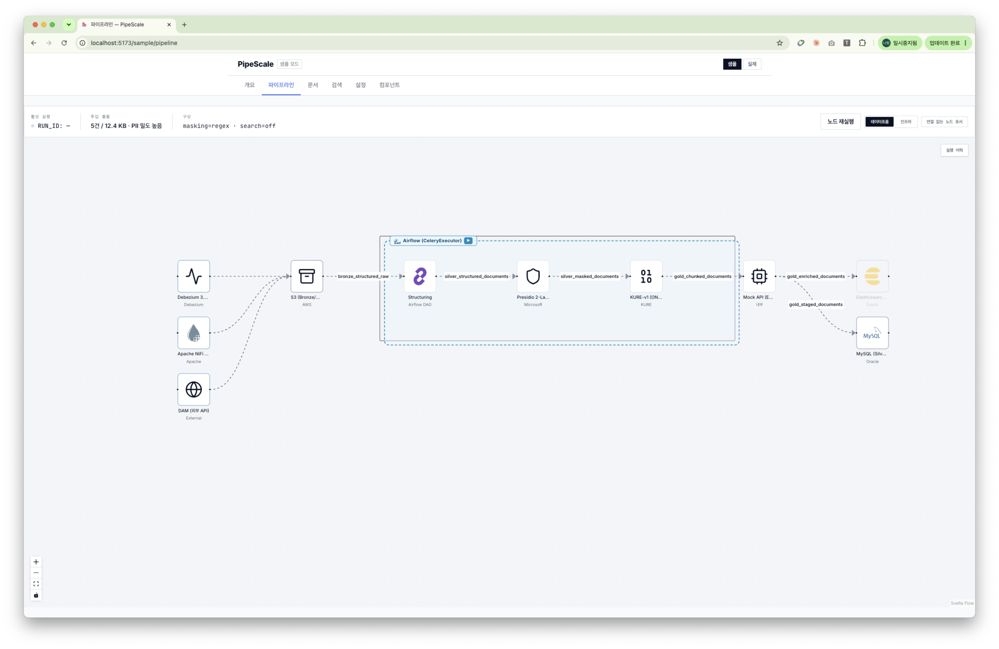
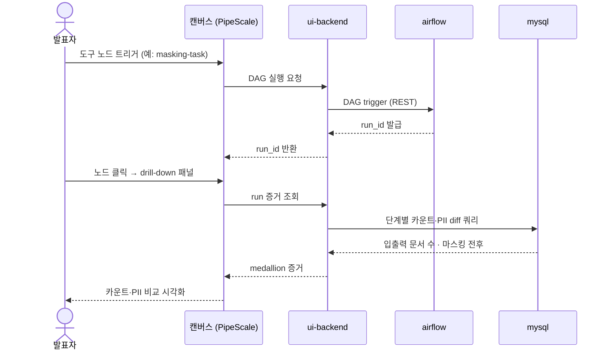
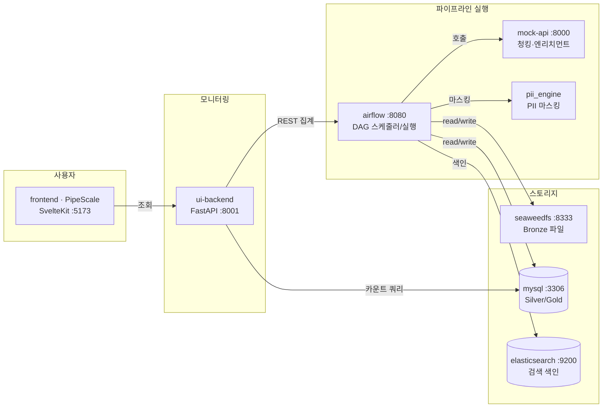
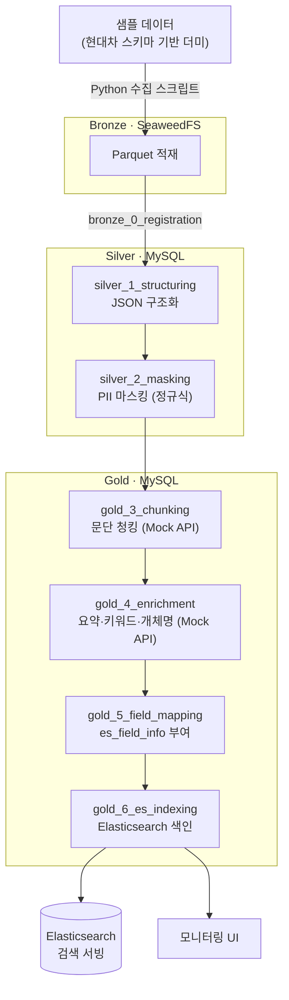
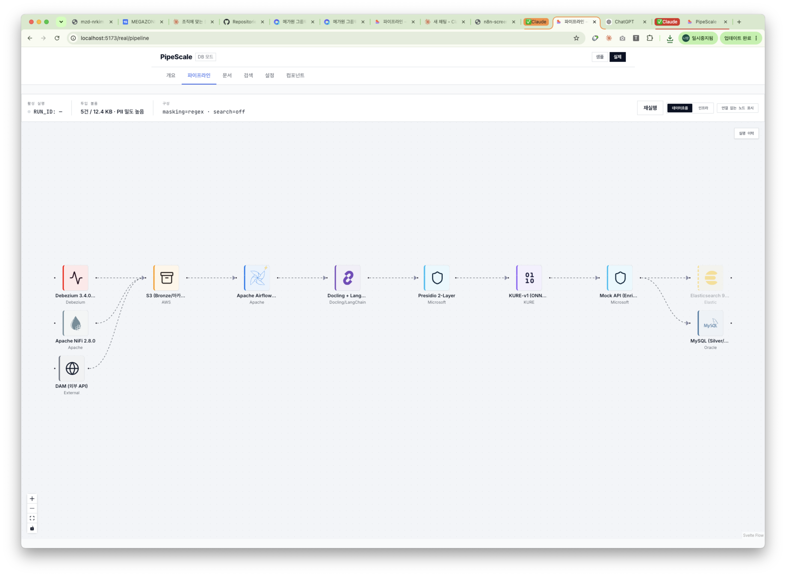

# pipeline-emulator — 프로젝트 개요

> 처음 보는 동료를 위한 5분 소개 문서. "이게 뭐고, 무엇을 보여주며, 어떻게 띄우는가"만 담았다.
> 상세 시연 순서는 [demo-scenario.md](./demo-scenario.md), 설계 배경·결정은 [pipeline-emulator-decisions.md](./pipeline-emulator-decisions.md) 참고.

---

## 한 줄 정의

현대차 LLM 플랫폼의 **Bronze → Silver → Gold 데이터 파이프라인**을 노트북 한 대(Docker Compose)에서 재현하고, 그 흐름을 **커스텀 대시보드(PipeScale)**로 실시간 모니터링하는 **데모용 에뮬레이터**다.

- **목적**: 경영진·고객·팀 시연 아티팩트. "파이프라인이 실제로 흐르고, medallion 단계별 증거를 눈으로 확인"시키는 것이 성공 기준.
- **원본**: `hyundaimotor-lllm` 운영계(NiFi 클러스터 + Airflow Celery + ES 등)를 데모 가치 위주로 경량화해 재현.



> PipeScale 캔버스 뷰: 좌측 수집 → Airflow 오케스트레이션 박스(구조화·마스킹·청킹·보강) → Gold 색인까지 한 화면에 흐름을 시각화.

---

## 무엇을 시연하나 (데모 포인트)

1. **medallion 파이프라인 흐름** — 샘플 문서가 Bronze(원본 적재) → Silver(구조화·PII 마스킹) → Gold(청킹·보강·필드매핑·색인)로 단계 통과하는 것을 대시보드에서 시각화.
2. **캔버스 뷰 드릴다운** — 캔버스의 도구 노드를 트리거하면 `run_id`가 발급되고, 패널에서 그 실행의 **입출력 문서 수 · PII 마스킹 전후 비교** 같은 증거를 즉시 확인.
3. **PII 마스킹** — 정규식(Layer1) 기반 개인정보 마스킹을 실제 데이터에 적용.
4. **모듈 교체 로드맵** — 설정 메뉴에서 각 단계 구현체(수집기·Executor·CDC·검색·마스킹)를 토글로 노출. 미구현 축은 "다음 계획" 배지로 로드맵 자체를 보여줌.

### 캔버스 드릴다운 상호작용



---

## 구성 요소 (기본 기동 6개 서비스 + 프론트엔드)

`docker compose up -d` 시 뜨는 기본 서비스:

| 서비스 | 포트 | 역할 |
|--------|------|------|
| **seaweedfs** | 8333 (S3) | S3 호환 오브젝트 스토리지 — Bronze 계층 파일 저장 |
| **mysql** | 3306 | 파이프라인 데이터 저장 (Silver/Gold 테이블) |
| **airflow** | 8080 | 스케줄러 + 웹서버, DAG 실행 (LocalExecutor) |
| **mock-api** | 8000 | 청킹·엔리치먼트 고객사 API를 대체하는 FastAPI 목서버 |
| **elasticsearch** | 9200 | Gold 색인(gold_6) 대상 검색 엔진 |
| **ui-backend** | 8001 | 모니터링 백엔드 (FastAPI) — Airflow REST + MySQL을 집계 |
| **frontend** *(별도 실행)* | 5173 | SvelteKit + @xyflow/svelte 대시보드 (`npm dev`로 기동) |

**프로필로 켜는 선택 서비스** (기본 off):
- `celery` — `airflow-worker` + `valkey`: CeleryExecutor 분산 실행 모드
- `cdc` — `debezium` + `valkey`: 실시간 변경 감지
- `nifi` — `zookeeper` + `nifi`: NiFi 수집기(Python 스크립트 대체)

**디렉토리 지도**:
- `dags/` — Airflow DAG 7종 (bronze_0 → silver_1 → silver_2 → gold_3 → gold_4 → gold_5 → gold_6_es_indexing)
- `pii_engine/` — PII 마스킹 엔진 (layer1 정규식, layer2 Presidio 예정)
- `mock_api/` — 청킹·엔리치먼트 API 시뮬레이터
- `ui-backend/` — 모니터링 FastAPI 백엔드
- `frontend/` — SvelteKit 대시보드 (제품명 **PipeScale**, `frontend/DESIGN.md`가 디자인 계약)
- `db/` — MySQL 마이그레이션·초기화 SQL
- `scripts/` — 샘플 데이터 생성·수집 스크립트

### 서비스 아키텍처



> 프로필로 켜는 선택 서비스(celery·cdc·nifi)는 기본 기동에 없어 위 그림에서 생략.

---

## 파이프라인 단계 (DAG 흐름)



실제 캔버스에서는 위 단계가 도구 노드(수집기·Airflow·마스킹·Mock API·검색·DB)로 가로 흐름으로 렌더된다:



---

## 어떻게 띄우나

```bash
cd pipeline-emulator

# 1. 백엔드 스택 기동 (기본 6개 서비스)
docker compose up -d

# 2. 프론트엔드 대시보드 기동
cd frontend && npm install && npm run dev
# → http://localhost:5173

# 3. 대시보드 진입: /sample/pipeline (캔버스 뷰)
```

- Airflow UI: http://localhost:8080 (DAG 실행 현황 원본 확인)
- 환경변수 템플릿은 `.env.example` 참고 (`.env`는 gitignored)

---

## 더 볼 문서

| 목적 | 문서 |
|------|------|
| 시연 순서·대사·체크리스트 | [demo-scenario.md](./demo-scenario.md) |
| 설계 결정·원본→에뮬레이터 대체·로드맵 | [pipeline-emulator-decisions.md](./pipeline-emulator-decisions.md) |
| 대시보드 페이지별 기능 명세 | [design-prompt-monitoring-dashboard.md](./design-prompt-monitoring-dashboard.md) |
| 개발 규칙·테스트·포트 맵 | [../CLAUDE.md](../CLAUDE.md) |
| 디자인 시스템 계약 | [../frontend/DESIGN.md](../frontend/DESIGN.md) |
