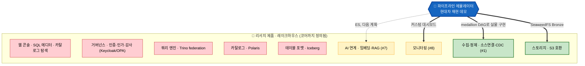

# 파이프라인 에뮬레이터는 리서치 제품의 어느 조각을 실증하는가

> 작성일: 2026-07-21 / 성격: 포지셔닝·관계 노트
> 대상 문서: [pipeline-emulator-decisions.md](./pipeline-emulator-decisions.md) ↔ 우륭경 「데이터 레이크하우스 / AI-Ready 데이터 플랫폼 선행 리서치」(2026-07-20)

---

## 이 문서의 시야

리서치는 **"어떤 제품을 만들 것인가"를 코어까지 정의한 완결된 제품 제안**이다(포지션·필요기능·스택·MVP·사업성 전부). 에뮬레이터는 그 제품의 **축소판이 아니라, 제품의 한 조각 — 데이터 수집·정제(필요기능 #1) — 을 현대차 재현 맥락에서 실물로 보여주는 데모**다.

이 문서는 그 관계를 정확히 세 갈래로 정리한다.

1. **포함** — 에뮬레이터가 실증하는 것은 리서치 제품의 *어느 조각인가*
2. **겹침** — 두 문서가 *독립적으로 같은 결론*에 도달한 스택·철학
3. **리서치 고유 코어** — 에뮬레이터에 *없는*, 제품의 본체(새로 만들 영역)

> **한 줄 결론**: 에뮬레이터 = 리서치 제품의 **수집·정제·스토리지 슬라이스를 돌려보는 실물 데모**. 제품의 코어(저장 테이블 포맷·조회·카탈로그·거버넌스·웹 콘솔)는 **리서치가 정의한 별도 영역이고 에뮬레이터엔 없다.** "에뮬레이터를 확장하면 제품이 된다"가 아니라, "에뮬레이터가 제품의 한 계층을 미리 증명한다"가 정확하다.

---

## 0. 리서치가 만들자는 제품은 무엇인가

관계를 논하려면 먼저 *리서치 제품의 실체*를 못박아야 한다. 리서치는 다음을 **구체적으로** 정의한다(막연한 조사가 아니다).

| 리서치가 정의한 것 | 내용 | 위치 |
|---|---|---|
| **제품 포지션** | Kubernetes 기반 설치형 경량 레이크하우스, AI-Ready 데이터 플랫폼 | §3, §9.1 |
| **목표 시장** | 외산 SaaS 도입이 어려운 국내 공공·금융·중견기업 (온프레미스·망분리) | §3, §9.2 |
| **필요기능 8개** | 소스연결 / 저장·테이블 / SQL·Federated / 카탈로그 / 권한·보안 / 품질 / AI·RAG / 모니터링 | §4 |
| **구체 스택** | Iceberg + Polaris + Trino + Keycloak/OPA + Qdrant + 자체 웹 콘솔 | §5 |
| **직접개발 vs 채택** | 콘솔·거버넌스·AI연계·한국어는 직접, 엔진·포맷·카탈로그는 오픈소스 | §6 |
| **MVP** | S3 + Iceberg + Polaris + Trino + Keycloak + 웹 콘솔 (3~6개월, 3~5인) | §7 |
| **사업성** | 수익 구조, 원가 절감, 시장 적합성, 왜 우리 팀인가 | §9 |

> 즉 리서치 제품의 **본체(코어)는 "저장(Iceberg)·조회(Trino)·카탈로그(Polaris)·거버넌스(Keycloak/OPA)·웹 콘솔"**이다. 데이터가 어떻게 들어와 정제되는지(수집·정제 ETL)는 이 코어를 **채우기 위한 입력 계층(필요기능 #1)**으로만 다뤄진다. **에뮬레이터가 대응하는 곳이 바로 이 입력 계층**이다.

---

## 1. 포함 — 에뮬레이터가 실증하는 조각

리서치 제품을 계층으로 세우고, 에뮬레이터가 **실물로 덮는 계층**을 표시하면 관계가 한눈에 보인다.

> **읽는 법**: 초록(스토리지·수집정제) = 에뮬레이터가 **실물로 덮는** 계층. 노랑(AI·모니터링) = **부분/다음 계획**. 빨강(테이블포맷·카탈로그·쿼리·거버넌스·콘솔) = **리서치 제품의 코어인데 에뮬레이터엔 없는** 계층. 에뮬레이터의 화살표가 스택의 *아래쪽(입력 계층)에만* 닿는다는 점이 핵심이다.

리서치 필요기능 8개에 대한 대응을 세분하면:

| # | 리서치 필요기능 | 단계 | 에뮬레이터 대응 | 실증 수준 |
|---|---|---|---|---|
| 1 | 데이터 소스 연결 (커넥터·CDC) | MVP | Python 수집 + Bronze 적재 + `change_operation` CDC 계약 | ✅ **실물** |
| 2 | 저장·테이블 관리 (Iceberg) | MVP | MySQL medallion (오픈 테이블 포맷 미사용) | ❌ 코어 불일치 |
| 3 | SQL·Federated Query (Trino) | MVP | 없음 | ❌ |
| 4 | 메타데이터·카탈로그 (Polaris) | MVP | 없음 | ❌ |
| 5 | 권한·보안·거버넌스 | MVP | PII 마스킹만 (인증·인가·감사 없음) | 🟡 일부 |
| 6 | 데이터 품질 | 확장 | 없음 | ❌ |
| 7 | AI·LLM·RAG 연계 | 확장 | ES 임베딩·하이브리드 (다음 계획) | 🟡 다음 계획 |
| 8 | 모니터링·사용량 | 확장 | SvelteKit 커스텀 대시보드 | ✅ **실물** |

> **정확한 포함 관계**: 에뮬레이터가 온전히 실증하는 것은 **#1(수집·정제)과 #8(모니터링)**, 그리고 스토리지(S3 호환) 계층이다. #5는 마스킹만, #7은 다음 계획. **#2·#3·#4(저장 테이블 포맷·조회·카탈로그) = 리서치 제품의 코어인데 에뮬레이터엔 없다.** 에뮬레이터는 제품의 *한 조각*을 미리 보여주지, 제품의 축소판이 아니다.

---

## 2. 겹침 — 독립적으로 같은 결론에 도달한 지점

에뮬레이터가 덮는 조각 안에서, 두 문서가 **서로 참조 없이 같은 선택**을 한 지점들. 겹침은 "슬라이스가 제품 방향과 어긋나지 않는다"는 근거다.

| 겹치는 지점 | 에뮬레이터 | 리서치 | 공유하는 근거 |
|---|---|---|---|
| **SeaweedFS** | S3 호환 스토리지로 채택 | 참조 구성으로 제시 (§5.2) | **동일** — MinIO 2025 CE 축소·AGPL 회피 |
| **BYO·모듈화 철학** | 계약층 고정 + 구현층 교체 (§6) | 표준 인터페이스 의존, 구현체 교체 (§8) | **사상 동일** — 벤더 리스크를 아키텍처로 흡수 |
| **CDC (Debezium)** | `op`→`change_operation` 어댑터 계약 | 필요기능 #1의 CDC 수단 | 배치↔실시간 교체 가능 |
| **PII 마스킹·규제 대응** | Presidio 2-Layer (정규식 + 한국어 NER) | 직접개발 "개인정보 자동 마스킹" (§6) | 국내 규제 대응 가치 |
| **Apache 2.0 지향** | SeaweedFS·Presidio 등 | 스택 전체 Apache/MIT (§5.2) | AGPL·BSL 회피 |

> 특히 **스토리지 계층(SeaweedFS+S3 호환)은 근거까지 판박이**다. 즉 에뮬레이터가 실증하는 *스토리지·수집 슬라이스*는 이미 리서치 제품이 그리는 입력 계층과 정렬돼 있다 — 이 조각만큼은 "제품의 미리보기"라 불러도 무방하다.

---

## 3. 리서치 고유 코어 — 에뮬레이터에 없는 제품의 본체

에뮬레이터가 **덮지 않는**, 곧 제품화하려면 **새로 만들어야 하는** 리서치 제품의 정체성 영역. 이것이 "에뮬레이터를 확장하면 제품이 된다"가 과장인 이유다 — 아래는 대부분 에뮬레이터에 없다.

- **테이블 포맷·카탈로그·쿼리** (Iceberg + Polaris + Trino) — 레이크하우스를 레이크하우스로 만드는 개방형 코어. 필요기능 #2·#3·#4 전부
- **웹 콘솔** — SQL 에디터·카탈로그 탐색·관리 화면. 리서치가 "직접개발 = 제품 정체성"이라 규정한 핵심 (§6)
- **인증·인가·감사** (Keycloak + OPA/Ranger) — 공공·금융의 도입 전제
- **데이터 품질** (Great Expectations/Soda, #6)
- **K8s Helm 설치형 배포 · 멀티테넌시 · 사용량 미터링**
- **상용화·시장 전략 전체** — 포지션, 경쟁 구도, MVP 정의, 투트랙 실행, 수익 구조 (에뮬레이터엔 개념 자체가 없음)

> 리서치 제품의 **부가가치는 이 코어(통합 콘솔 + 거버넌스 + federation)에서 나온다**고 리서치 스스로 밝힌다(§6, §9.4). 에뮬레이터가 덮는 수집·정제는 제품의 *입력 계층*이지 *부가가치 계층*이 아니다. 둘은 담당 층이 다르다.

---

## 4. (참고) 저장 포맷 한 축 — MySQL vs Iceberg

에뮬레이터가 정제 데이터를 **MySQL**에, 리서치가 **Iceberg**를 택한 것은 필요기능 #2에서의 선택 차이다. 관점을 정리해 둔다.

- **MySQL은 결핍이 아니다** — 원본 현대차가 Silver/Gold를 MySQL로 쓰므로 *충실 재현*이라는 에뮬레이터 성공 기준의 산물이다. Iceberg는 *벤더중립 ACID 오픈포맷*이라는 제품 성공 기준의 산물이다.
- **Bronze는 이미 정렬** — 에뮬레이터의 Bronze(SeaweedFS+Parquet)는 리서치 저장 계층의 하부와 동일하다. Iceberg는 이 위에 테이블 메타데이터를 씌우는 일.
- **단, Iceberg는 혼자 오지 않는다** — Iceberg 테이블은 **카탈로그가 필수**이고, 조회하려면 **엔진(Trino/DuckDB)**이 사실상 필요하다. 즉 저장만 바꿔도 코어(#2→#3·#4)가 함께 딸려온다.
- **그래서 "확장해도 여전히 슬라이스"** — 설령 `STORAGE=iceberg` 토글을 만들어 제품 형상을 미리 보여준다 해도, 에뮬레이터가 실증하는 범위는 여전히 **수집·정제 + 저장 슬라이스**다. 콘솔·거버넌스·federation 코어는 별개로 남는다.

> 데모 활용 아이디어: `STORAGE=mysql`(재현 모드) ↔ `STORAGE=iceberg`(제품 저장 형상 미리보기) 토글은 에뮬레이터의 기존 BYO 철학과 맞아떨어진다. 다만 이는 *저장 한 계층의 미리보기*일 뿐, 제품 코어 전체의 실증은 아니라는 경계를 지킨다.

---

## 5. 데모 스토리텔링에서의 가치와 경계

에뮬레이터를 리서치 맥락에 걸면 **"제품의 데이터 입력 계층이 실제로 이렇게 흐른다"**는 실물 증거를 얻는다.

- 경영진·고객 시연: 리서치(전략·제품 정의) → 에뮬레이터(입력 계층 동작 증거) 순으로 이으면 "그림"에 "증거"가 붙는다.
- feature-flag 토글은 리서치의 **BYO·교체가능 아키텍처를 UI로 시연**하는 장치가 된다.

**경계를 정직하게** — 오독을 막는 한 문장:

> 에뮬레이터는 리서치 제품의 **수집·정제·스토리지 계층(필요기능 #1·#8 중심)을 실증**하는 데모다. 제품의 코어(테이블 포맷·조회·카탈로그·거버넌스·웹 콘솔)와 상용화는 **리서치가 정의한 별도 영역**이며, 이 데모의 범위가 아니다. "동작하는 제품 MVP"가 아니라 "**제품의 한 계층을 미리 증명하는 실물**"로 규정한다.

---

## 참고

- 에뮬레이터 결정사항 원본: [pipeline-emulator-decisions.md](./pipeline-emulator-decisions.md)
- 우륭경 「데이터 레이크하우스 / AI-Ready 데이터 플랫폼 선행 리서치」(2026-07-20) — Tech Platform센터 AI Data Engineering팀
