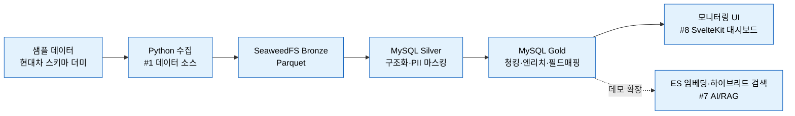
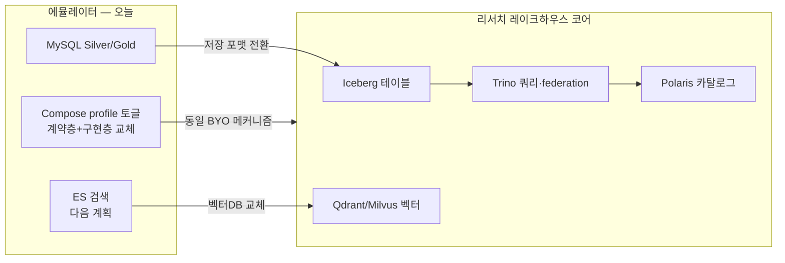

# 파이프라인 에뮬레이터는 레이크하우스 선행 리서치의 어디에 앉는가

> 작성일: 2026-07-21 / 성격: 포지셔닝·관계 노트
> 대상 문서: [pipeline-emulator-decisions.md](./pipeline-emulator-decisions.md) ↔ 우륭경 「선행 리서치 및 개발 방향」(2026-07-20)

---

## 이 문서의 목적

파이프라인 에뮬레이터(현대차 데이터 파이프라인 로컬 재현 데모)를 **중심에 놓고**, 우륭경의 레이크하우스/AI-Ready 데이터 플랫폼 선행 리서치 안에서 이 프로젝트가 **어느 계층에 대응하고, 어디서 겹치며, 어디서 갈라지는지**를 정리한다.

핵심 결론: **에뮬레이터는 리서치가 그리는 플랫폼의 "수집·정제 파이프라인 + AI-Ready 데이터 준비" 계층을 눈에 보이게 실증하는 조각**이다. 다만 저장·쿼리·카탈로그 **코어 스택은 서로 다른 선택**을 하고 있어, "에뮬레이터 = 레이크하우스 MVP"로 읽으면 틀린다. 상보 관계이되 스택은 부분적으로만 겹친다.

---

## 1. 한눈에 — 계층 매핑

리서치는 **제품·전략**(3~6개월 레이크하우스 MVP, 시장 포지션)을, 에뮬레이터는 **데모 아티팩트**(2주 시연물)를 다룬다. 시야와 목적이 다르지만, 에뮬레이터가 커버하는 범위는 리서치 플랫폼의 특정 계층과 정확히 포개진다.

| 리서치의 레이크하우스 계층 (§5.1) | 에뮬레이터의 대응 | 관계 |
|---|---|---|
| 스토리지 (S3 호환) | SeaweedFS (Bronze) | **직접 대응** |
| 테이블 포맷 (Iceberg/Parquet) | Bronze는 Parquet, Silver/Gold는 MySQL | **부분 대응** (오픈 테이블 포맷 미사용) |
| 카탈로그 (Polaris) | 없음 | 미대응 |
| 쿼리 엔진 (Trino) | 없음 | 미대응 |
| 거버넌스 (Keycloak/OPA, 마스킹) | PII 마스킹(Presidio 2-Layer) | **부분 대응** (인증·인가 없음, 마스킹만) |
| AI 연계 (임베딩·벡터·RAG) | ES 인덱싱·E5 임베딩·하이브리드 (다음 계획) | **대응** (벡터DB 선택은 다름) |
| (리서치가 다루지 않는) 수집·정제 파이프라인 | **medallion DAG (Bronze→Silver→Gold)** | **에뮬레이터의 고유 기여** |

> 리서치는 레이크하우스의 **저장·쿼리·카탈로그 코어**에 무게를 싣고, 데이터가 어떻게 들어와 정제되는지(ETL 파이프라인)는 §4 필요기능 #1(데이터 소스 연결)로만 짧게 언급한다. 에뮬레이터는 바로 그 **파이프라인 계층을 medallion 방식으로 구체화**한다 — 두 문서가 서로의 빈칸을 채운다.

```mermaid
flowchart TB
    subgraph LH["리서치 레이크하우스 스택 · 에뮬레이터 대응 색상"]
        direction TB
        ST["스토리지 — S3 호환 (SeaweedFS)"]:::full
        ING["수집 · CDC"]:::full
        TF["테이블 포맷 — Iceberg"]:::partial
        CAT["카탈로그 — Polaris"]:::none
        QE["쿼리 엔진 — Trino"]:::none
        GOV["거버넌스 — 인증·인가·마스킹"]:::partial
        AI["AI 연계 — 임베딩·벡터·RAG"]:::full
        MON["모니터링 · UX"]:::full
    end

    L1["■ 직접/전체 대응"]:::full
    L2["■ 부분 대응"]:::partial
    L3["■ 미대응"]:::none

    classDef full fill:#c8e6c9,stroke:#2e7d32,color:#000
    classDef partial fill:#fff3c4,stroke:#f9a825,color:#000
    classDef none fill:#ffcdd2,stroke:#c62828,color:#000
```

> 초록(스토리지·수집·AI·모니터링)이 에뮬레이터가 실물로 보여주는 계층, 노랑(테이블 포맷·거버넌스)은 일부만, 빨강(카탈로그·쿼리 엔진)은 에뮬레이터에 없는 리서치 고유 코어다.

---

## 2. 리서치 필요기능표(§4)에 대한 에뮬레이터의 대응

리서치는 필요기능을 8개 영역으로 나눈다(앞 5개 MVP, 뒤 3개 확장). 에뮬레이터가 실증하는 것은 그중 **#1과 #7**이다.

| # | 리서치 기능 영역 | 단계 | 에뮬레이터 대응 |
|---|---|---|---|
| 1 | 데이터 소스 연결 (커넥터, CDC) | MVP | Python 수집 + CDC 계약 선점(`change_operation`), Debezium 어댑터 경로 |
| 2 | 저장·테이블 관리 (Iceberg) | MVP | **불일치** — MySQL medallion, Iceberg 미사용 |
| 3 | SQL·Federated Query (Trino) | MVP | 없음 |
| 4 | 메타데이터·카탈로그 (Polaris) | MVP | 없음 |
| 5 | 권한·보안·거버넌스 | MVP | PII 마스킹만 (인증·인가·감사 없음) |
| 6 | 데이터 품질 | 확장 | 없음 |
| 7 | **AI·LLM·RAG 연계** | 확장 | **ES 임베딩·하이브리드 검색** (데모 클라이맥스, 다음 계획) |
| 8 | 모니터링·사용량 | 확장 | **커스텀 대시보드** (SvelteKit + xyflow, 에뮬레이터의 핵심 산출물) |

**해석**: 에뮬레이터는 리서치의 MVP 저장·쿼리·카탈로그 코어(#2·#3·#4)를 **대체하지 않는다**. 대신 리서치가 상대적으로 얇게 다루는 **수집 파이프라인(#1), AI 연계(#7), 모니터링 UX(#8)**를 실물로 보여준다. 즉 리서치 제품의 "전후 계층"을 시연하는 데모다.

> 파란 박스 전체가 에뮬레이터의 실증 범위다. 리서치 필요기능 **#1·#7·#8**에 정확히 대응하며, 그 사이의 저장·쿼리·카탈로그(#2·#3·#4)는 에뮬레이터에서 MySQL medallion으로 압축돼 있다.

---

## 3. 겹치는 지점 — 연결의 근거

두 문서가 **독립적으로 같은 결론에 도달한** 지점들. 이것이 연결을 정당화한다.

- **SeaweedFS (근거까지 동일)** — 양쪽 모두 S3 호환 스토리지로 SeaweedFS를 택하고, 사유도 판박이다: MinIO 2025 커뮤니티 에디션 축소·AGPL 상용전환 회피. (에뮬레이터 decisions §참고소스 주석 ↔ 리서치 §5.2 스토리지)
- **BYO·모듈화 철학** — 리서치의 "표준 인터페이스(S3 API·Iceberg REST)에만 의존, 구현체는 교체 가능"(§8 리스크 대응) ↔ 에뮬레이터의 "계약층 고정 + 구현층 교체"(§6 3층 분리). **사상이 사실상 동일**하다 — 라이선스·벤더 리스크를 아키텍처 차원에서 흡수한다는 같은 원칙.
- **CDC(Debezium)** — 둘 다 교체 가능한 수집 모드로 취급. 리서치 #1의 CDC ↔ 에뮬레이터의 Debezium 어댑터 계약 선점.
- **PII 마스킹 / 규제 대응** — 리서치의 "국내 규제 대응, 개인정보 컬럼 자동 마스킹"(§6 직접개발 영역) ↔ 에뮬레이터의 Presidio 2-Layer(정규식 + 한국어 NER).
- **AI/RAG·벡터 검색** — 리서치 확장 #7(임베딩·벡터·text-to-SQL) ↔ 에뮬레이터의 ES E5 임베딩·BM25·Vector RRF 하이브리드(다음 계획).

---

## 4. 갈라지는 지점 — 오도하지 않으려면

연결하되 다음을 명확히 해야 한다. **코어 스택이 다르며, 이는 모순이 아니라 목적 차이**다(현대차 파이프라인 충실 재현 vs 벤더중립 제품 코어).

| 축 | 에뮬레이터 | 리서치 | 왜 다른가 |
|---|---|---|---|
| 정제 데이터 저장 | **MySQL** (Silver/Gold) | **Iceberg/Parquet** 오픈 테이블 포맷 | 에뮬레이터는 원본(현대차)이 MySQL을 쓰므로 충실 재현. 리서치는 벤더중립·ACID 오픈 포맷이 제품 핵심 |
| 쿼리 엔진 | 없음 | **Trino** federation | 에뮬레이터는 조회가 데모 범위 밖. 리서치는 federation이 제품의 축 |
| 카탈로그 | 없음 | **Polaris** (Iceberg REST) | 에뮬레이터는 단일 파이프라인이라 불필요. 리서치는 상호운용성의 핵심 |
| 벡터DB | **Elasticsearch** (E5) | **Qdrant/Milvus** | 에뮬레이터는 원본 ES 스택 재현. 리서치는 운영부담 낮은 Qdrant 우선 |

> 요컨대 에뮬레이터는 **medallion(Bronze/Silver/Gold) ETL 관점**으로 설계됐고, 리서치는 **레이크하우스(Iceberg 테이블 + Trino 조회) 관점**으로 설계됐다. 겹치는 스토리지·철학을 공유하되, 데이터의 "형상"을 다루는 코어는 서로 다른 선택지다.

---

## 5. 수렴 경로 — 에뮬레이터의 "다음 계획"이 리서치와 만나는 곳

에뮬레이터 decisions 문서의 **"다음 계획(MVP 이후)"** 축들은, 방향을 리서치 쪽으로 틀면 그대로 레이크하우스 제품 요소로 수렴한다. 즉 에뮬레이터는 리서치로 가는 **막다른 데모가 아니라 진입 트랙**이 될 수 있다.

- **검색 서빙(ES) 축** → 리서치의 AI/RAG 연계(#7). 에뮬레이터가 이미 임베딩·하이브리드 검색 경로를 설계해 둠.
- **모듈화 스위칭층(환경변수 + Compose profile)** → 리서치의 BYO·교체가능 설계와 동일한 메커니즘.
- **(잠재적) 저장 포맷 전환** → 에뮬레이터가 Silver/Gold를 MySQL 대신 Iceberg로 두는 순간, 리서치의 저장·테이블 계층(#2)과 직접 정합된다. *현재 에뮬레이터엔 없는 축이지만, 리서치와 정렬하려면 여기가 관문이다.*

> 관문은 **A1 → B1** — 에뮬레이터가 Silver/Gold를 MySQL 대신 Iceberg로 두는 순간 리서치 저장·테이블 계층과 정합된다. 나머지(Trino·Polaris·벡터)는 그 위에 얹힌다.

**한 줄 요약**: 에뮬레이터는 리서치 플랫폼의 **수집·정제·AI 준비 계층을 오늘 당장 돌려보는 PoC**이고, 저장 포맷을 Iceberg로 옮기고 Trino/Polaris를 얹으면 리서치의 레이크하우스 코어로 확장되는 경로 위에 있다.

---

## 6. 데모 스토리텔링에서의 가치

에뮬레이터를 리서치의 맥락에 걸면, 단순 "현대차 파이프라인 재현"을 넘어 **"우리가 만들 레이크하우스 제품의 데이터 진입·정제·AI 준비 파이프라인이 실제로 이렇게 흐른다"**는 서사를 얻는다.

- 경영진·고객 시연에서: 리서치(전략 슬라이드) → 에뮬레이터(동작하는 실물) 순으로 이으면 "그림"이 "증거"로 바뀐다.
- 에뮬레이터의 설정 메뉴(feature-flag 토글: 수집기·CDC·검색·마스킹)는 리서치의 **BYO·교체가능 아키텍처를 UI로 시연**하는 장치가 된다.

---

## 참고

- 에뮬레이터 결정사항 원본: [pipeline-emulator-decisions.md](./pipeline-emulator-decisions.md)
- 우륭경 「데이터 레이크하우스 / AI-Ready 데이터 플랫폼 선행 리서치」(2026-07-20) — Tech Platform센터 AI Data Engineering팀
