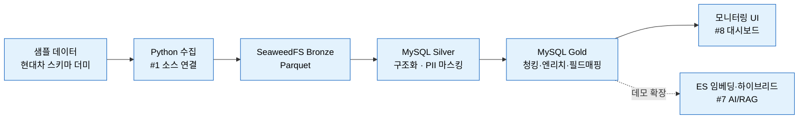
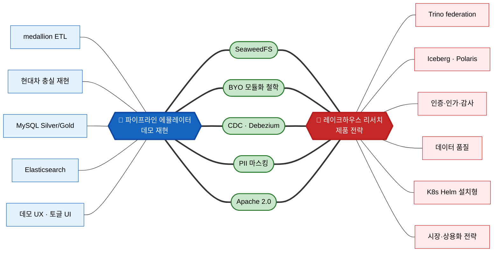
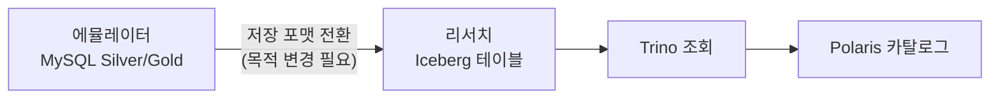

# 파이프라인 에뮬레이터 ↔ 레이크하우스 선행 리서치 — 포함·겹침·차이

> 작성일: 2026-07-21 / 성격: 포지셔닝·관계 노트 (재작성판)
> 대상 문서: [pipeline-emulator-decisions.md](./pipeline-emulator-decisions.md) ↔ 우륭경 「데이터 레이크하우스 / AI-Ready 데이터 플랫폼 선행 리서치」(2026-07-20)

---

## 이 문서의 목적

파이프라인 에뮬레이터와 레이크하우스 선행 리서치의 관계를 **세 갈래로 분해**해 명시한다.

1. **포함** — 에뮬레이터가 리서치 플랫폼의 *어느 계층을 실물로 실증*하는가 (부분집합 관계)
2. **겹침** — 두 문서가 *독립적으로 같은 결론*에 도달한 스택·철학
3. **차이** — 둘이 *본질적으로 갈라지는* 지점 (성격의 차이 → 코어 스택의 차이)

> **한 줄 결론**: 에뮬레이터와 리서치는 **성격이 다른 두 프로젝트**다 — 하나는 *기존 현대차 파이프라인의 충실 재현 데모*, 다른 하나는 *벤더중립 신제품 설계 전략*. 그 성격 차이 때문에 에뮬레이터는 리서치 플랫폼의 **수집·정제·AI준비 계층만 부분적으로 실증**하고, **저장·쿼리·카탈로그 코어는 서로 다른 선택**을 한다. "에뮬레이터 = 레이크하우스 MVP"로 읽으면 틀린다.

---

## 0. 먼저 — 두 프로젝트의 성격 (차이의 근원)

포함·겹침·차이가 모두 여기서 갈라진다. **가장 중요한 표**다.

| 축 | 파이프라인 에뮬레이터 | 레이크하우스 리서치 |
|---|---|---|
| **본질** | 데모 아티팩트 (동작하는 시연물) | 제품·시장 전략 (자체 개발 방향성) |
| **시선** | 과거 지향 — *기존* 현대차 파이프라인 **재현** | 미래 지향 — *신규* 벤더중립 제품 **설계** |
| **성공 기준** | "현대차와 똑같이 흐른다"는 충실도 + 검색 임팩트 | 시장 포지션·상호운용성·상용화 가능성 |
| **대상** | 특정 파이프라인 (현대차 LLM 데이터) | 범용 플랫폼 (국내 공공·금융·중견기업) |
| **규모·기간** | 1인 · 2주 | 3~5인 · 3~6개월 MVP |
| **산출물** | Docker Compose 스택 + 모니터링 UI (노트북) | K8s Helm 설치형 제품 |

> 이 성격 차이가 결정적이다. 예컨대 에뮬레이터가 정제 데이터를 **MySQL**에 두는 것은 리서치 대비 "결핍"이 아니라, *원본(현대차)이 MySQL을 쓰므로 충실 재현*이라는 **에뮬레이터 성공 기준의 산물**이다. 반대로 리서치가 **Iceberg**를 택한 것은 *벤더중립 ACID 오픈포맷*이라는 **제품 성공 기준의 산물**이다. 같은 잣대로 우열을 매길 대상이 아니다.

---

## 1. 한눈에 — 포함·겹침·차이 요약

| 리서치 계층 (§5.1 / 필요기능 §4) | 에뮬레이터의 대응 | 관계 |
|---|---|---|
| 스토리지 (S3 호환) | SeaweedFS (Bronze) | 🟢 **겹침** (근거까지 동일) |
| 데이터 소스 연결·수집 (#1, CDC) | Python 수집 + medallion DAG + `change_operation` 계약 | 🟢 **포함** (에뮬레이터가 실증) |
| 거버넌스 — 마스킹 (§6 직접개발) | Presidio 2-Layer (PII 마스킹) | 🟢 **겹침·포함** |
| AI·RAG 연계 (#7) | ES E5 임베딩·하이브리드 검색 (다음 계획) | 🟡 **포함** (벡터DB 선택은 다름) |
| 모니터링·사용량 (#8) | SvelteKit + xyflow 커스텀 대시보드 | 🟢 **포함** (에뮬레이터 핵심 산출물) |
| 테이블 포맷 (Iceberg/Parquet) | Bronze만 Parquet, Silver/Gold는 MySQL | 🟡 **차이** (오픈 테이블 포맷 미사용) |
| 쿼리 엔진 (Trino federation) | 없음 | 🔴 **차이** (리서치 고유) |
| 카탈로그 (Polaris) | 없음 | 🔴 **차이** (리서치 고유) |
| 인증·인가 (Keycloak/OPA) | 없음 (마스킹만) | 🔴 **차이** (리서치 고유) |
| 데이터 품질 (GE/Soda, #6) | 없음 | 🔴 **차이** (리서치 고유) |
| 배포·패키징 (K8s Helm) | Docker Compose (노트북) | 🔴 **차이** |
| — (리서치가 얇게 다룸) | **medallion ETL (Bronze→Silver→Gold) 구체화** | 🔵 **에뮬레이터 고유** |

🟢 겹침/포함 · 🟡 부분 · 🔴 리서치 고유(에뮬레이터에 없음) · 🔵 에뮬레이터 고유(리서치가 얇게 다룸)

```mermaid
flowchart TB
    subgraph LH["레이크하우스 리서치 스택 — 에뮬레이터 대응"]
        direction TB
        ST["스토리지 · S3 호환 (SeaweedFS)"]:::full
        ING["수집 · CDC · medallion ETL"]:::emu
        GOV["거버넌스 · 마스킹"]:::full
        AI["AI 연계 · 임베딩·RAG"]:::partial
        MON["모니터링 · 대시보드"]:::full
        TF["테이블 포맷 · Iceberg"]:::none
        QE["쿼리 엔진 · Trino"]:::none
        CAT["카탈로그 · Polaris"]:::none
        AUTH["인증·인가 · Keycloak/OPA"]:::none
        DEPLOY["배포 · K8s Helm"]:::none
    end

    L1["■ 겹침·포함 (실증)"]:::full
    L2["■ 부분 포함"]:::partial
    L3["■ 리서치 고유 (에뮬레이터 없음)"]:::none
    L4["■ 에뮬레이터 고유"]:::emu

    classDef full fill:#c8e6c9,stroke:#2e7d32,color:#000
    classDef partial fill:#fff3c4,stroke:#f9a825,color:#000
    classDef none fill:#ffcdd2,stroke:#c62828,color:#000
    classDef emu fill:#bbdefb,stroke:#1565c0,color:#000
```

---

## 2. 포함 — 에뮬레이터가 실증하는 리서치 계층

에뮬레이터는 리서치 플랫폼 **전체의 MVP가 아니라**, 리서치가 상대적으로 얇게 다루는 **"데이터 진입 → 정제 → AI 준비 → 모니터링"** 계층을 *돌아가는 실물*로 보여준다. 리서치 필요기능 8개 중 **#1·#7·#8 + §6 직접개발(마스킹)**에 대응한다.

| 리서치 필요기능 | 단계 | 에뮬레이터의 실증 | 포함 수준 |
|---|---|---|---|
| #1 데이터 소스 연결 (커넥터·CDC) | MVP | Python 수집 + Bronze 적재 + `change_operation` CDC 계약 선점 + Debezium 어댑터 경로 | ✅ 실물 |
| #5 거버넌스 중 **마스킹** | MVP | Presidio 2-Layer (정규식 + 한국어 NER) | ✅ 실물 (인증·인가는 제외) |
| #7 AI·LLM·RAG 연계 | 확장 | ES E5 임베딩 · BM25 · Vector RRF 하이브리드 검색 (데모 클라이맥스) | 🟡 다음 계획 |
| #8 모니터링·사용량 | 확장 | SvelteKit + @xyflow/svelte 커스텀 대시보드 (단계별 카운트·상태) | ✅ 실물 (에뮬레이터 핵심 산출물) |

> **포함의 정확한 의미**: 에뮬레이터가 커버하는 범위는 리서치 플랫폼의 *특정 계층과 포개진다*. 다만 그 사이의 저장·쿼리·카탈로그(#2·#3·#4)는 에뮬레이터에서 **MySQL medallion으로 압축**돼 있다. 즉 에뮬레이터는 리서치 제품의 **"전(수집·정제)·후(AI·모니터링) 계층"을 시연하는 데모**이지, 코어(#2·#3·#4)를 대체하지 않는다.

---

## 3. 겹침 — 독립적으로 같은 결론에 도달한 지점

두 문서가 **서로를 참조하지 않고도 같은 선택**을 한 지점들. 이것이 두 프로젝트를 나란히 놓을 근거다.

| 겹치는 지점 | 에뮬레이터 | 리서치 | 공유하는 근거 |
|---|---|---|---|
| **SeaweedFS** | S3 호환 스토리지로 채택 | 참조 구성으로 SeaweedFS 제시 (§5.2) | **동일** — MinIO 2025 CE 축소·AGPL 상용전환 회피 |
| **BYO·모듈화 철학** | 계약층 고정 + 구현층 교체 (3층 분리, §6) | 표준 인터페이스(S3 API·Iceberg REST)에만 의존, 구현체 교체 (§8) | **사상 동일** — 라이선스·벤더 리스크를 아키텍처로 흡수 |
| **CDC (Debezium)** | 교체 가능한 수집 모드, `op`→`change_operation` 어댑터 | 필요기능 #1의 CDC 수단 | 배치↔실시간 교체 가능 설계 |
| **PII 마스킹·규제 대응** | Presidio 2-Layer (정규식 + 한국어 NER) | 직접개발 영역 "개인정보 컬럼 자동 마스킹" (§6) | 국내 규제 대응이 제품/데모 가치 |
| **Apache 2.0 지향** | SeaweedFS·Presidio 등 오픈 스택 | 스택 전체 Apache/MIT로 상용화 리스크 차단 (§5.2) | AGPL·BSL 회피 |

> 특히 **SeaweedFS는 근거 문장까지 판박이**이고, **BYO 철학은 메커니즘까지 동형**이다(에뮬레이터의 `환경변수 + Compose profile` 토글 ↔ 리서치의 표준 인터페이스 의존). 이 겹침이 우연이 아니라 *같은 원칙(벤더 리스크의 아키텍처적 흡수)에서 도출*됐다는 점이 두 프로젝트를 연결하는 실질 근거다.

---

## 4. 차이 — 본질적으로 갈라지는 지점

차이는 두 층위로 나뉜다. **① 성격의 차이(근원)** → **② 코어 스택의 차이(파생)**. ②의 모든 항목은 ①에서 설명된다 — 모순이 아니라 *목적이 다르기 때문에 다른 것*이다.

### 4.1 코어 스택의 차이

| 축 | 에뮬레이터 | 리서치 | 왜 다른가 (성격에서 파생) |
|---|---|---|---|
| **정제 데이터 저장** | **MySQL** (Silver/Gold) | **Iceberg/Parquet** 오픈 테이블 포맷 | 에뮬레이터: 원본이 MySQL → 충실 재현 / 리서치: 벤더중립 ACID가 제품 핵심 |
| **쿼리 엔진** | 없음 (조회는 데모 범위 밖) | **Trino** federation | 에뮬레이터: 파이프라인 흐름이 데모 / 리서치: federation이 제품의 축 |
| **카탈로그** | 없음 (단일 파이프라인) | **Polaris** (Iceberg REST) | 에뮬레이터: 단일 흐름이라 불필요 / 리서치: 상호운용성의 핵심 |
| **벡터 DB** | **Elasticsearch** (E5) | **Qdrant/Milvus** | 에뮬레이터: 원본 ES 스택 재현 / 리서치: 운영부담 낮은 Qdrant 우선 |
| **거버넌스 범위** | 마스킹만 | **인증·인가·감사** (Keycloak/OPA) 포함 | 에뮬레이터: 마스킹이 데모 포인트 / 리서치: 공공·금융의 도입 전제 조건 |
| **배포·패키징** | Docker Compose (노트북 7컨테이너) | **K8s Helm** 단일 설치 | 에뮬레이터: 로컬 시연 / 리서치: 설치형 상용 제품 |
| **설계 관점** | **medallion ETL** (Bronze/Silver/Gold) | **레이크하우스** (Iceberg 테이블 + Trino 조회) | 데이터의 "흐름"을 보여주기 vs 데이터의 "형상"을 다루기 |

### 4.2 리서치에만 있는 것 (에뮬레이터에 없음) — 리서치 고유 코어

에뮬레이터가 **재현하지 않는**, 리서치 제품의 정체성 영역:

- **Trino federation** — 이기종 소스 무이동 조인 (리서치 제품의 첫 설득 요소)
- **Iceberg 테이블 포맷 + Polaris 카탈로그** — 복수 엔진이 같은 테이블을 일관 참조하는 개방형 코어
- **SQL·JDBC/ODBC 콘솔** — 웹 SQL 에디터·BI 연계
- **인증·인가·감사** (Keycloak + OPA/Ranger) — 규제 고객 도입 전제
- **데이터 품질** (Great Expectations/Soda, #6)
- **K8s Helm 설치형 배포 + 멀티테넌시 + 사용량 미터링**
- **상용화·시장 전략 전체** — 목표 포지션, 경쟁 구도, 투트랙 실행, 수익 구조 (에뮬레이터엔 개념 자체가 없음)

### 4.3 에뮬레이터에만 있는 것 (리서치가 얇게 다룸) — 에뮬레이터 고유 기여

- **medallion DAG ETL의 구체화** — 리서치는 수집·정제를 필요기능 #1로만 짧게 언급. 에뮬레이터는 Bronze→Silver→Gold 6개 DAG로 *데이터가 어떻게 들어와 정제되는지*를 실물로 구현
- **현대차 파이프라인 충실 재현** — 특정 실무 파이프라인을 스택 단순화(NiFi→Python, Celery→Local)까지 매핑해 재현
- **동작하는 데모 UX** — 그림(전략)이 아니라 *돌아가는 증거*
- **BYO를 UI로 시연** — feature-flag 토글(수집기·CDC·검색·마스킹)로 "교체 가능 아키텍처"를 화면에서 보여주는 장치

> **읽는 법**: 파란 허브(에뮬레이터)·빨간 허브(리서치)가 두 프로젝트다. **가는 선으로 한쪽 허브에만 달린 노드 = 그 프로젝트 고유**(왼쪽 파랑 = §4.3 에뮬레이터 고유, 오른쪽 빨강 = §4.2 리서치 고유). **초록 노드는 굵은 선으로 양쪽 허브에 동시에 연결 = 겹침**(§3, 독립적으로 같은 결론에 도달). 즉 가운데를 가로지르는 5개 초록 노드가 교집합이다.

---

## 5. 그래서 관계는 — 종속이 아니라 인접

에뮬레이터는 리서치의 "미완성 MVP"가 **아니다**. 성격이 다른 별개 프로젝트이며, 다만 **일부 계층에서 포개지고 일부 스택·철학에서 겹친다**. 관계를 정리하면:

- **에뮬레이터는** 리서치 플랫폼의 *수집·정제·AI준비·모니터링 계층을 오늘 당장 돌려보는 실물 데모*다 — 리서치가 얇게 다루는 "전후 계층"을 채운다.
- **리서치는** 에뮬레이터가 데모 범위 밖으로 둔 *저장·쿼리·카탈로그·거버넌스 코어와 상용화 전략*을 채운다.
- 둘은 **서로의 빈칸을 채우는 인접 프로젝트**다. 겹치는 곳(SeaweedFS·BYO 철학)은 *독립적으로 같은 결론에 도달*했다는 점에서 서로를 정당화하고, 다른 곳(MySQL↔Iceberg, ES↔Qdrant)은 *목적이 다르므로 다른 것*이지 우열이 아니다.

### (참고) 만약 정렬한다면 — 수렴 관문

에뮬레이터를 리서치 제품 방향으로 *틀고 싶다면*, 관문은 하나다: **정제 저장을 MySQL → Iceberg로 전환**하는 것. 그 순간 리서치의 저장·테이블 계층(#2)과 정합되고, 그 위에 Trino·Polaris가 얹힌다. 단 이는 *에뮬레이터의 현재 목적(현대차 충실 재현)을 바꾸는 선택*이므로, 자동 귀결이 아니라 **의도적 방향 전환**이다.

---

## 6. 데모 스토리텔링에서의 가치

에뮬레이터를 리서치 맥락에 걸면, 단순 "현대차 파이프라인 재현"을 넘어 **"우리가 만들 레이크하우스 제품의 데이터 진입·정제·AI 준비 계층이 실제로 이렇게 흐른다"**는 서사를 얻는다.

- 경영진·고객 시연: 리서치(전략 슬라이드) → 에뮬레이터(동작하는 실물) 순으로 이으면 **"그림"이 "증거"로** 바뀐다.
- 에뮬레이터의 feature-flag 토글은 리서치의 **BYO·교체가능 아키텍처를 UI로 시연**하는 장치가 된다.
- 단, 발표 시 **경계를 명확히** 해야 오해가 없다: *"에뮬레이터는 제품의 수집·정제·AI준비 계층을 실증하며, 저장·쿼리·카탈로그 코어와 상용화는 리서치가 정의한 별도 영역"*이라고 선을 그으면 "이게 곧 제품 MVP"라는 오독을 막는다.

---

## 참고

- 에뮬레이터 결정사항 원본: [pipeline-emulator-decisions.md](./pipeline-emulator-decisions.md)
- 우륭경 「데이터 레이크하우스 / AI-Ready 데이터 플랫폼 선행 리서치」(2026-07-20) — Tech Platform센터 AI Data Engineering팀
