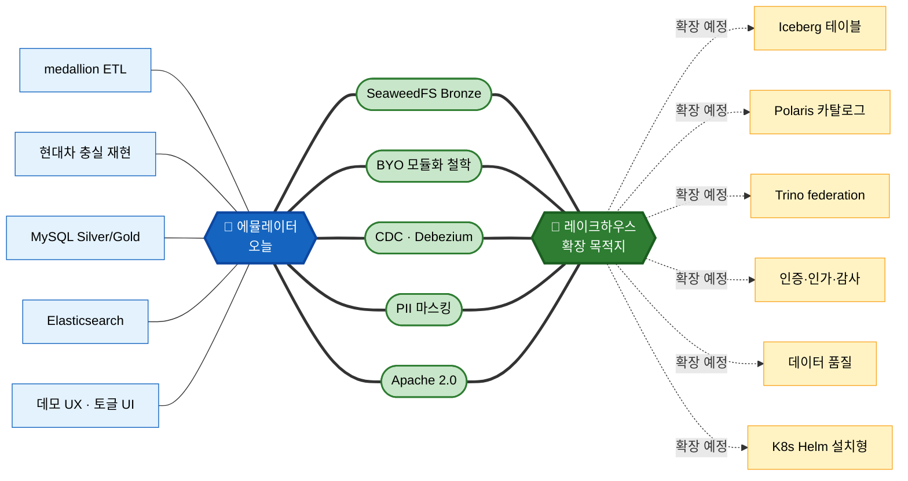
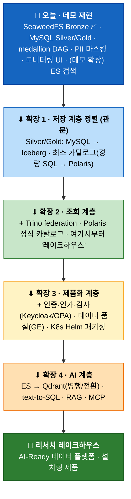

# 파이프라인 에뮬레이터 → 레이크하우스 확장 로드맵

> 작성일: 2026-07-21 / 성격: 확장 경로·정렬 현황 노트
> 대상 문서: [pipeline-emulator-decisions.md](./pipeline-emulator-decisions.md) ↔ 우륭경 「데이터 레이크하우스 / AI-Ready 데이터 플랫폼 선행 리서치」(2026-07-20)

---

## 이 문서의 시야

두 프로젝트를 **정적으로 비교(무엇이 다른가)** 하는 대신, **에뮬레이터가 리서치 레이크하우스로 확장되는 경로를 시점 기준(무엇이 언제 붙는가)**으로 정리한다.

- **에뮬레이터 = 출발점** (오늘 돌아가는 데모)
- **리서치 레이크하우스 = 목적지** (확장이 향하는 제품)
- 둘 사이의 "차이"는 *영구적 간극*이 아니라 **아직 붙지 않은 확장 단계**로 읽는다.

> **한 줄 결론**: 에뮬레이터는 이미 **스토리지(SeaweedFS Bronze)·수집·정제·마스킹 계층이 리서치와 정렬**돼 있고, 여기서 **저장 포맷(MySQL→Iceberg)을 관문으로** 조회(Trino)·카탈로그(Polaris)·거버넌스·AI를 단계적으로 얹으면 리서치 레이크하우스에 도달한다. 확장은 *대체가 아니라 토글의 추가* — 에뮬레이터의 기존 모듈화(BYO) 철학 그대로다.

---

## 0. 출발점과 목적지

| 축 | 🔵 에뮬레이터 (출발점) | 🎯 리서치 레이크하우스 (목적지) |
|---|---|---|
| **오늘의 정체성** | 데모 아티팩트 — 현대차 파이프라인 충실 재현 | 제품·시장 전략 — 벤더중립 설치형 플랫폼 |
| **성공 기준** | "현대차와 똑같이 흐른다" + 검색 임팩트 | 상호운용성·상용화·시장 포지션 |
| **저장** | Bronze=SeaweedFS/Parquet, Silver/Gold=MySQL | S3 + Iceberg + Polaris |
| **규모·기간** | 1인 · 2주 | 3\~5인 · 3\~6개월 MVP |
| **산출물** | Docker Compose + 모니터링 UI (노트북) | K8s Helm 설치형 제품 |

> **핵심 관점 전환**: MySQL은 "리서치 대비 부족한 것"이 아니라 **재현 충실도라는 오늘의 성공 기준이 선택한 값**이다. Iceberg는 "에뮬레이터에 없는 것"이 아니라 **제품 방향으로 확장할 때 켜는 다음 값**이다. 둘은 같은 저장 계층의 *두 모드*이며, 확장은 이 모드를 전환·병존시키는 일이다.

---

## 1. 정렬 현황 — 오늘 어디까지 와 있나

확장의 출발선을 세 갈래로 본다: **이미 정렬됨(그대로 굴러갈 토대)** / **확장 예정(로드맵)** / **재현 특화(데모 모드로 유지, 일부는 확장 시 전환)**.

> **읽는 법**: 가운데 **초록 노드 = 이미 양쪽에 정렬된 토대**(굵은 선으로 두 허브에 동시 연결). 왼쪽 **파랑 = 오늘의 재현 코어**. 오른쪽 **노랑(점선) = 아직 안 붙은 확장 예정 항목**. 초록이 많을수록 출발선이 목적지에 가깝다는 뜻이다 — 스토리지·수집·마스킹·라이선스·철학이 이미 정렬돼 있다.

---

## 2. 이미 정렬된 토대 — 왜 확장 경로가 짧은가

두 문서가 **서로 참조 없이 같은 결론**에 도달한 지점들. 이것들이 이미 정렬돼 있어 확장이 "처음부터 다시"가 아니다.

| 정렬된 토대 | 에뮬레이터 | 리서치 | 확장 관점의 의미 |
|---|---|---|---|
| **오브젝트 스토리지** | SeaweedFS + Bronze Parquet | S3 호환 + SeaweedFS 참조 (§5.2) | **Bronze는 이미 레이크하우스 저장 계층** — Iceberg 전환의 절반은 완료 |
| **SeaweedFS 선택 근거** | MinIO AGPL 회피 | MinIO CE 축소 회피 (§5.2) | 스토리지 재선정 불필요 |
| **BYO·모듈화 철학** | 계약층 고정+구현층 교체 (§6) | 표준 인터페이스 의존, 구현체 교체 (§8) | **확장 = 새 토글 추가**라는 메커니즘이 이미 설계됨 |
| **CDC (Debezium)** | `op`→`change_operation` 어댑터 계약 선점 | 필요기능 #1의 CDC 수단 | 실시간 수집 확장 시 계약 재사용 |
| **PII 마스킹** | Presidio 2-Layer | 직접개발 "개인정보 자동 마스킹" (§6) | 거버넌스 확장의 첫 조각이 이미 있음 |
| **Apache 2.0 라이선스** | 오픈 스택 | 상용화 리스크 차단 (§5.2) | 확장 스택 전체가 상용화 제약 없음 |

> 특히 **Bronze(SeaweedFS+Parquet)가 이미 정렬**돼 있다는 점이 결정적이다. 리서치 저장 계층이 "S3 + Iceberg(Parquet)"이므로, 에뮬레이터는 *저장 계층의 절반(오브젝트 스토리지 + 컬럼 포맷)을 이미 만족*한다. 남은 건 그 위에 **테이블 메타데이터(Iceberg)**를 씌우는 일이다.

---

## 3. 확장 로드맵 — 무엇이 언제 붙나

에뮬레이터에서 리서치 레이크하우스로 가는 길을 **단계로** 끊는다. 각 단계는 *앞 단계를 버리지 않고 위에 얹는 증분*이며, 전환 트리거(언제 켜나)를 함께 둔다.

| 단계 | 붙는 것 | 전환 트리거 (언제) | 재사용 (이미 있는 것) | 새로 필요한 것 |
|---|---|---|---|---|
| **오늘** | 데모 재현 파이프라인 | — | — | — |
| **확장 1 · 저장 정렬** (관문) | Silver/Gold를 Iceberg 테이블로 | "벤더중립 제품 형상"을 시연해야 할 때 | Bronze 오브젝트 스토리지, DAG transform 로직, `change_operation` 계약 | Iceberg 라이터(PyIceberg/Spark) + 카탈로그 |
| **확장 2 · 조회** | Trino federation, Polaris 정식화 | 이기종 조인·SQL 콘솔이 데모 요구가 될 때 | Iceberg 테이블(확장1 산출) | Trino, Polaris(REST) |
| **확장 3 · 제품화** | 인증·인가·감사, 품질, K8s Helm | 데모 → 설치형 제품으로 성격 전환 시 | 마스킹(거버넌스 첫 조각), Compose 스택 | Keycloak/OPA, GE/Soda, Helm 차트 |
| **확장 4 · AI** | Qdrant, text-to-SQL, RAG | AI 서빙을 벤더중립 스택으로 보일 때 | ES 임베딩·하이브리드 설계(다음 계획), Gold `es_field_info` | Qdrant, LLM 연계 |

> **증분 원칙**: 각 단계는 앞 단계 위에 *얹힌다*. 확장 1의 Iceberg 테이블이 확장 2 Trino의 조회 대상이 되고, 확장 1~2의 저장·조회가 확장 3 거버넌스의 통제 대상이 된다. 되돌리기 쉬운 순서(저장→조회→거버넌스→AI)로 배치했다.

---

## 4. 관문 심층 — MySQL Silver/Gold → Iceberg

확장 1이 로드맵 전체의 **관문**이다(이후 Trino·Polaris·거버넌스가 모두 여기에 얹힌다). "MySQL은 데모, Iceberg는 확장"이라는 판단이 **성립하는 이유와 조건**을 정리한다.

### 4.1 왜 성립하나 — 이미 절반은 정렬됨

- **Bronze는 이미 SeaweedFS(오브젝트 스토리지) + Parquet(컬럼 포맷)** — 리서치 저장 계층의 하부 절반과 동일. Iceberg는 이 위에 **테이블 메타데이터 계층**만 씌우면 된다.
- **medallion 자체가 배치 변환** (Bronze→Silver→Gold) — Iceberg는 배치·분석 워크로드에 최적. DAG의 *변환 로직(구조화·마스킹·청킹·엔리치)은 그대로*, **싱크(sink)만 MySQL INSERT → Iceberg write**로 교체된다.
- **에뮬레이터는 이미 "구현층 교체" 철학** — 저장 백엔드 교체는 새 개념이 아니라 기존 토글(`COLLECTOR`, `MASK`, `SEARCH`…)에 `STORAGE=mysql|iceberg` 하나를 더하는 일.

### 4.2 무엇이 함께 딸려오나 — Iceberg는 혼자 오지 않는다

여기가 정확히 봐야 할 지점이다. **Iceberg 테이블은 단독으로 완결되지 않는다.**

- **카탈로그가 필수** — Iceberg는 스냅샷·스키마·파일 목록을 추적할 카탈로그가 반드시 필요하다(MySQL은 불필요했던 계층). 데모 초기엔 **경량 SQL 카탈로그**(PyIceberg + SQLite/PostgreSQL)로 시작 가능하고, 제대로 하려면 **Polaris**(Iceberg REST)로 간다.
- **조회 엔진이 사실상 필요** — MySQL은 그 자체로 SQL 조회가 됐지만, Iceberg 테이블을 사람이 보려면 **Trino/DuckDB/Spark** 같은 엔진이 있어야 한다. 즉 저장을 Iceberg로 옮기면 **조회 계층(확장 2)이 자연히 따라온다.**
- **행 단위 갱신은 무겁다** — 파이프라인의 `change_operation`(insert/update/delete)을 Iceberg에서 구현하려면 v2 merge-on-read가 필요해 MySQL보다 복잡하다. 배치 재적재 위주면 문제없지만, 실시간 CDC까지 겹치면 설계 부담이 는다.

> **결론**: "MySQL→Iceberg"는 실제로는 **"Iceberg + 카탈로그 + (조회 엔진)" 묶음**을 끌어온다. 이것이 관문이 로드맵의 분기점인 이유다 — 저장 하나만 바꾸는 게 아니라, 그 순간부터 레이크하우스 코어(Iceberg·Polaris·Trino)가 함께 서기 시작한다.

### 4.3 대체가 아니라 병존 — 토글로 두는 이유

Iceberg 전환은 에뮬레이터의 정체성(현대차 충실 재현)을 **바꾸는** 선택이다. 그래서 MySQL을 없애기보다 **모드로 병존**시키는 게 맞다:

- `STORAGE=mysql` → **재현 모드** (현대차와 동일, 기존 데모)
- `STORAGE=iceberg` → **제품 미리보기 모드** (우리 레이크하우스 제품의 저장 형상)

하나의 에뮬레이터로 **"이것이 현대차 현재 파이프라인"**과 **"이것이 우리 제품이 그리는 모습"**을 토글 하나로 오가며 시연할 수 있다 — 이게 확장 로드맵이 데모에 주는 가장 큰 무기다.

---

## 5. 두 개의 확장 벡터 — 방향을 혼동하지 않기

에뮬레이터의 **자체 "다음 계획"**(decisions 문서)과 **이 문서의 확장 로드맵**은 *다른 방향*을 가리킨다. 혼동하면 안 된다.

| | 벡터 A · 재현 심화 (에뮬레이터 자체 로드맵) | 벡터 B · 제품 확장 (이 문서) |
|---|---|---|
| **향하는 곳** | 원본 현대차 운영계에 더 가깝게 | 리서치 레이크하우스 제품으로 |
| **대표 항목** | CeleryExecutor, NiFi 클러스터, ES 3-master, 풀 Presidio | Iceberg, Polaris, Trino, Keycloak/OPA, K8s Helm |
| **목적** | 충실도↑ (현대차와 더 똑같이) | 제품성↑ (벤더중립 상용 형상) |

- **겹치는 항목도 있다**: 실시간 CDC(Debezium), 검색 서빙(ES→ 향후 벡터DB), PII 마스킹 고도화는 두 벡터가 공유한다.
- **갈라지는 축**: 저장 포맷이 대표적이다. 벡터 A는 MySQL을 *유지*(현대차가 MySQL이므로), 벡터 B는 Iceberg로 *전환*. → 그래서 §4.3의 **병존 토글**이 두 벡터를 한 스택에 담는 해법이 된다.

> 이 문서는 **벡터 B**를 다룬다. "에뮬레이터를 계속 파면 저절로 레이크하우스가 된다"는 아니다 — 벡터 B는 *의도적으로 방향을 트는* 확장이며, 그 방향 전환의 관문이 §4의 Iceberg다.

---

## 6. 데모 스토리텔링에서의 가치

확장 로드맵 관점은 데모에 **시간 축의 서사**를 준다.

- **오늘**: "현대차 파이프라인이 이렇게 흐릅니다" (재현 모드, 동작하는 증거)
- **한 토글 뒤**: "같은 파이프라인을 우리 제품 형상(Iceberg)으로 바꾸면 이렇게 됩니다" (제품 미리보기 모드)
- **로드맵 화면**: 미구현 확장 축을 **"다음 계획" 배지**로 노출 → 설정 메뉴 자체가 *제품 로드맵을 시연하는 장치*가 된다.

경영진·고객 시연에서 리서치(전략 슬라이드) → 에뮬레이터(오늘 동작) → 토글(제품 방향 미리보기) 순으로 이으면, **"그림 → 증거 → 확장 경로"**가 한 화면에서 이어진다.

> 단, 경계는 정직하게: 에뮬레이터는 오늘 **수집·정제·AI준비·모니터링**을 실증하고, **저장·조회·카탈로그 코어와 상용화는 확장 1~3을 거쳐 도달**하는 목적지다. "오늘의 데모 = 완성된 제품 MVP"가 아니라 "**제품으로 가는 검증된 출발점**"으로 규정한다.

---

## 참고

- 에뮬레이터 결정사항 원본: [pipeline-emulator-decisions.md](./pipeline-emulator-decisions.md)
- 우륭경 「데이터 레이크하우스 / AI-Ready 데이터 플랫폼 선행 리서치」(2026-07-20) — Tech Platform센터 AI Data Engineering팀
