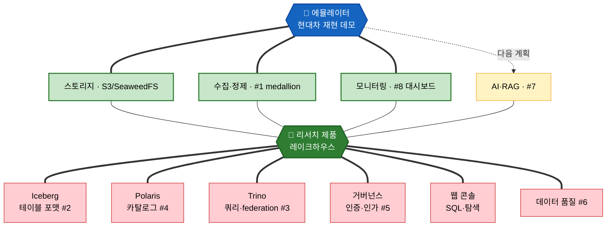

# 파이프라인 에뮬레이터와 리서치 제품의 관계

> 작성일: 2026-07-21 / 성격: 관계 정리 노트
> 대상 문서: [pipeline-emulator-decisions.md](./pipeline-emulator-decisions.md) ↔ 우륭경 「데이터 레이크하우스 / AI-Ready 데이터 플랫폼 선행 리서치」(2026-07-20)

---

## 정리 배경

리서치는 "어떤 제품을 만들 것인가"를 코어까지 정의한 제품 제안서다(포지션·필요기능·스택·MVP·사업성). 에뮬레이터는 그 제품의 축소판이 아니라, 제품의 한 부분인 데이터 수집·정제(필요기능 #1)를 현대차 재현 형태로 구현한 데모다.

관계를 세 가지로 나눠 본다.

1. 포함 — 에뮬레이터가 커버하는 것이 제품의 어느 부분인지
2. 겹침 — 두 문서가 따로 검토했는데 같은 결론에 도달한 부분
3. 리서치 코어 — 에뮬레이터에 없는, 제품의 핵심 부분

요약하면, 에뮬레이터는 제품의 수집·정제·스토리지 부분을 실제로 돌려보는 데모다. 저장 테이블 포맷·조회·카탈로그·거버넌스·웹 콘솔 같은 제품 코어는 리서치가 정의한 영역이고 에뮬레이터에는 없다. "에뮬레이터를 확장하면 제품이 된다"기보다 "에뮬레이터가 제품의 한 부분을 먼저 구현해 본 것"에 가깝다.

---

## 0. 리서치가 만들려는 제품

관계를 보기 전에 리서치 제품이 무엇인지부터 짚는다. 리서치는 다음을 구체적으로 정의한다.

| 리서치가 정의한 것 | 내용 | 위치 |
|---|---|---|
| 제품 포지션 | Kubernetes 기반 설치형 경량 레이크하우스, AI-Ready 데이터 플랫폼 | §3, §9.1 |
| 목표 시장 | 외산 SaaS 도입이 어려운 국내 공공·금융·중견기업 (온프레미스·망분리) | §3, §9.2 |
| 필요기능 8개 | 소스연결 / 저장·테이블 / SQL·Federated / 카탈로그 / 권한·보안 / 품질 / AI·RAG / 모니터링 | §4 |
| 구체 스택 | Iceberg + Polaris + Trino + Keycloak/OPA + Qdrant + 자체 웹 콘솔 | §5 |
| 직접개발 vs 채택 | 콘솔·거버넌스·AI연계·한국어는 직접, 엔진·포맷·카탈로그는 오픈소스 | §6 |
| MVP | S3 + Iceberg + Polaris + Trino + Keycloak + 웹 콘솔 (3~6개월, 3~5인) | §7 |
| 사업성 | 수익 구조, 원가 절감, 시장 적합성, 왜 우리 팀인가 | §9 |

제품의 코어는 저장(Iceberg)·조회(Trino)·카탈로그(Polaris)·거버넌스(Keycloak/OPA)·웹 콘솔이다. 데이터가 어떻게 들어와 정제되는지는 이 코어를 채우는 입력 부분(필요기능 #1)으로 다뤄진다. 에뮬레이터가 맡는 곳이 이 입력 부분이다.

---

## 1. 포함 — 에뮬레이터가 커버하는 부분

리서치 제품을 계층으로 세우고, 에뮬레이터가 실제로 덮는 계층을 표시하면 관계가 보인다.

> 읽는 법: 위 파랑 허브(에뮬레이터)가 굵은 선으로 잇는 초록 노드가 실제로 덮는 부분(스토리지·수집정제·모니터링)이다. 노랑(AI·RAG)은 다음 계획. 이 부분들이 가운데 초록 허브(리서치 제품)로 모이고, 리서치는 여기에 더해 아래 빨강 노드 6개(제품 코어)를 갖는다. Iceberg·Polaris·Trino·거버넌스·웹 콘솔·품질은 모두 에뮬레이터에 없다. 정리하면 에뮬레이터는 리서치 제품에 포함되고, 겹치는 부분은 위쪽뿐이다.

리서치 필요기능 8개에 대한 대응은 다음과 같다.

| # | 리서치 필요기능 | 단계 | 에뮬레이터 대응 | 커버 정도 |
|---|---|---|---|---|
| 1 | 데이터 소스 연결 (커넥터·CDC) | MVP | Python 수집 + Bronze 적재 + `change_operation` CDC 계약 | ✅ 구현 |
| 2 | 저장·테이블 관리 (Iceberg) | MVP | MySQL medallion (오픈 테이블 포맷 미사용) | ❌ 코어 불일치 |
| 3 | SQL·Federated Query (Trino) | MVP | 없음 | ❌ |
| 4 | 메타데이터·카탈로그 (Polaris) | MVP | 없음 | ❌ |
| 5 | 권한·보안·거버넌스 | MVP | PII 마스킹만 (인증·인가·감사 없음) | 🟡 일부 |
| 6 | 데이터 품질 | 확장 | 없음 | ❌ |
| 7 | AI·LLM·RAG 연계 | 확장 | ES 임베딩·하이브리드 (다음 계획) | 🟡 다음 계획 |
| 8 | 모니터링·사용량 | 확장 | SvelteKit 커스텀 대시보드 | ✅ 구현 |

에뮬레이터가 온전히 구현하는 것은 #1(수집·정제)과 #8(모니터링), 그리고 스토리지(S3 호환)다. #5는 마스킹만, #7은 다음 계획이다. 저장 테이블 포맷·조회·카탈로그(#2·#3·#4)는 리서치 제품의 코어인데 에뮬레이터에는 없다. 에뮬레이터는 제품의 한 부분을 먼저 보여줄 뿐, 제품 전체의 축소판은 아니다.

---

## 2. 겹침 — 따로 검토했는데 같은 결론에 도달한 부분

에뮬레이터가 덮는 부분 안에서, 두 문서가 서로 참조 없이 같은 선택을 한 지점들이다. 겹침은 에뮬레이터의 방향이 제품 방향과 어긋나지 않는다는 근거가 된다.

| 겹치는 지점 | 에뮬레이터 | 리서치 | 공유하는 근거 |
|---|---|---|---|
| SeaweedFS | S3 호환 스토리지로 채택 | 참조 구성으로 제시 (§5.2) | 동일 — MinIO 2025 CE 축소·AGPL 회피 |
| BYO·모듈화 | 계약층 고정 + 구현층 교체 (§6) | 표준 인터페이스 의존, 구현체 교체 (§8) | 같은 생각 — 벤더 리스크를 아키텍처로 흡수 |
| CDC (Debezium) | `op`→`change_operation` 어댑터 계약 | 필요기능 #1의 CDC 수단 | 배치↔실시간 교체 가능 |
| PII 마스킹 | Presidio 2-Layer (정규식 + 한국어 NER) | 직접개발 "개인정보 자동 마스킹" (§6) | 국내 규제 대응 |
| Apache 2.0 | SeaweedFS·Presidio 등 | 스택 전체 Apache/MIT (§5.2) | AGPL·BSL 회피 |

특히 스토리지(SeaweedFS + S3 호환)는 선택 근거까지 같다. 에뮬레이터가 구현하는 스토리지·수집 부분은 리서치 제품이 그리는 입력 계층과 이미 정렬돼 있는 셈이다.

---

## 3. 리서치 코어 — 에뮬레이터에 없는 부분

에뮬레이터가 덮지 않는, 제품화하려면 새로 만들어야 하는 영역이다. "에뮬레이터를 확장하면 제품이 된다"가 과장인 이유가 여기 있다. 아래는 대부분 에뮬레이터에 없다.

- 테이블 포맷·카탈로그·쿼리 (Iceberg + Polaris + Trino) — 레이크하우스의 핵심 개방형 코어. 필요기능 #2·#3·#4
- 웹 콘솔 — SQL 에디터·카탈로그 탐색·관리 화면. 리서치가 직접개발 대상으로 꼽은 제품 정체성 영역 (§6)
- 인증·인가·감사 (Keycloak + OPA/Ranger) — 공공·금융의 도입 전제
- 데이터 품질 (Great Expectations/Soda, #6)
- K8s Helm 설치형 배포·멀티테넌시·사용량 미터링
- 상용화·시장 전략 전체 — 포지션, 경쟁 구도, MVP 정의, 투트랙 실행, 수익 구조. 에뮬레이터에는 개념 자체가 없다

리서치는 제품의 부가가치가 이 코어(통합 콘솔 + 거버넌스 + federation)에서 나온다고 스스로 밝힌다(§6, §9.4). 에뮬레이터가 덮는 수집·정제는 제품의 입력 부분이지 부가가치 부분이 아니다. 둘은 맡는 층이 다르다.

---

## 4. (참고) MySQL과 Iceberg

에뮬레이터가 정제 데이터를 MySQL에, 리서치가 Iceberg를 택한 것은 필요기능 #2에서의 선택 차이다.

- MySQL은 부족해서 고른 게 아니다. 원본 현대차가 Silver/Gold를 MySQL로 쓰기 때문에 충실 재현이라는 에뮬레이터 기준에서 나온 선택이다. Iceberg는 벤더중립 ACID 오픈포맷이라는 제품 기준에서 나온 선택이다.
- Bronze는 이미 맞춰져 있다. 에뮬레이터의 Bronze(SeaweedFS + Parquet)는 리서치 저장 계층의 아래쪽과 같다. Iceberg는 그 위에 테이블 메타데이터를 얹는 일이다.
- 다만 Iceberg는 혼자 오지 않는다. Iceberg 테이블은 카탈로그가 반드시 있어야 하고, 조회하려면 엔진(Trino/DuckDB)이 사실상 필요하다. 저장만 바꿔도 코어(#2 → #3·#4)가 따라온다.
- 그래서 저장 포맷을 바꿔도 에뮬레이터가 커버하는 범위는 여전히 수집·정제 + 저장 부분이다. 콘솔·거버넌스·federation 코어는 별개로 남는다.

데모 활용 아이디어로, `STORAGE=mysql`(재현 모드) ↔ `STORAGE=iceberg`(제품 저장 형상 미리보기) 토글은 에뮬레이터의 기존 BYO 설계와 맞는다. 단 이건 저장 한 계층의 미리보기일 뿐, 제품 코어 전체를 보여주는 것은 아니다.

---

## 5. 데모에서의 활용과 한계

에뮬레이터를 리서치와 함께 놓으면 "제품의 데이터 입력 부분이 실제로 이렇게 돈다"는 증거를 얻는다.

- 경영진·고객 시연에서 리서치(제품 정의) → 에뮬레이터(입력 부분 동작) 순으로 이으면 설명에 실물이 붙는다.
- feature-flag 토글은 리서치의 BYO·교체 가능 설계를 화면으로 보여주는 장치가 된다.

한계도 분명히 해 둔다. 에뮬레이터는 리서치 제품의 수집·정제·스토리지 부분(필요기능 #1·#8 중심)을 구현한 데모다. 제품 코어(테이블 포맷·조회·카탈로그·거버넌스·웹 콘솔)와 상용화는 리서치가 정의한 별도 영역이고 이 데모의 범위가 아니다. 완성된 제품 MVP가 아니라 제품의 한 부분을 먼저 돌려본 것으로 보면 된다.

---

## 참고

- 에뮬레이터 결정사항 원본: [pipeline-emulator-decisions.md](./pipeline-emulator-decisions.md)
- 우륭경 「데이터 레이크하우스 / AI-Ready 데이터 플랫폼 선행 리서치」(2026-07-20) — Tech Platform센터 AI Data Engineering팀
